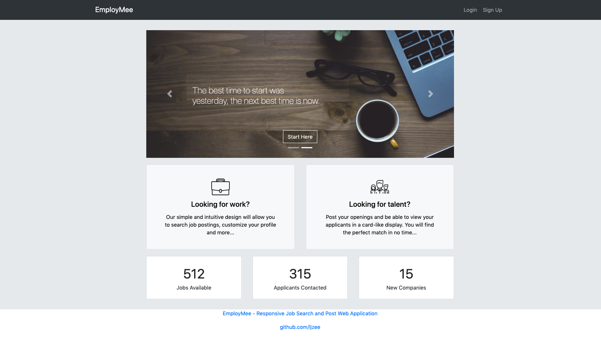
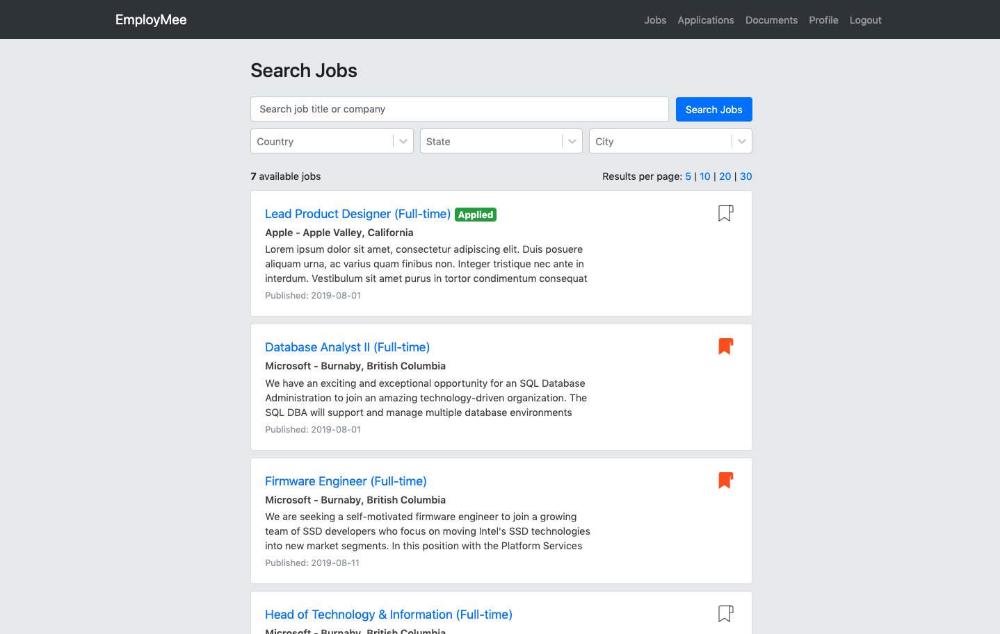
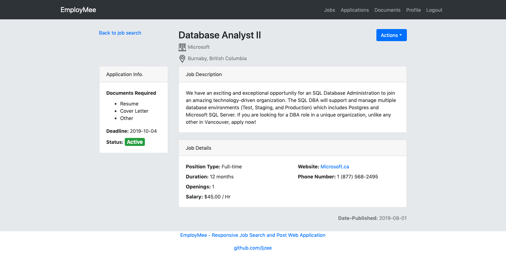
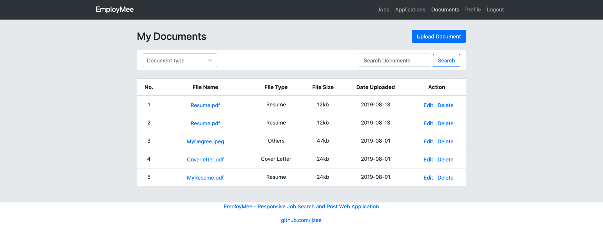
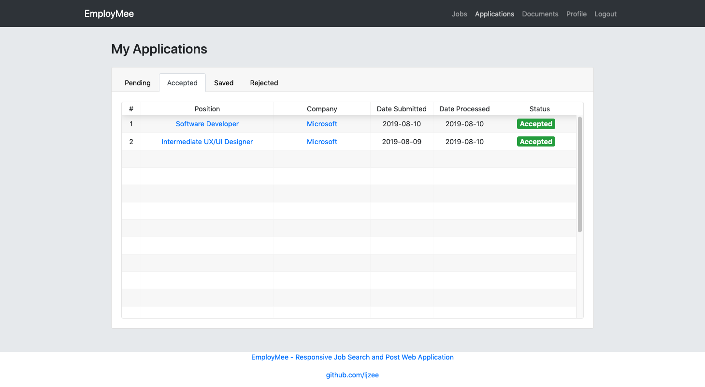
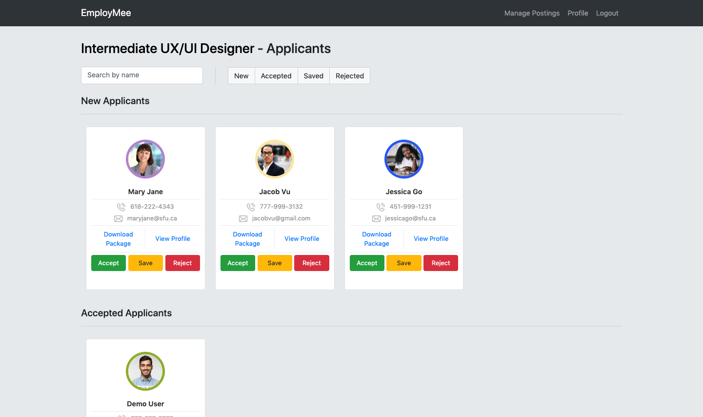
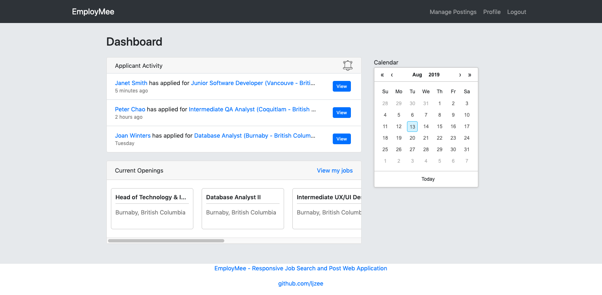

# EmployMee (Solo Full Stack Project)

(React/Node/Express/PostgreSQL)

EmployMee is a web application for job seekers to search and apply for job openings, and for employers to publish their job openings. EmployMee was developed with UX in mind ensuring both job seekers and employers easy access to the information that matters the most to them. EmployMee is also completely responsive, meaning you can have an enjoyable experience no matter the screen size you're using it on.

**Personal Remarks**

I was inspired to create EmployMee after collaborating with four others to develop a similar application in summer 2018 for my 400-level university course. The original project (Jobs-n-Stuff) was an attempt to improve our school's Co-op website by applying UX techniques. While we were satisfied with our project, our complex stack (React, GraphQL-Yoga, Prisma, Docker...) meant most of our time was spent learning the technolgies rather than delivering features. I saw the potential to develop more features which is why I decided to create EmployMee with a simpler stack.

**My goals for the project:**

* Add more features
* Practice full-stack development(front-end, back-end, database-design, deployment)
* Design a responsive UI

## Core Features

EmployMee can be used by two types of users, namely **job seekers** and **employers**. 

### As a job seeker you can:

* Search/bookmark/apply to jobs

* View job posting

* Upload and manage your documents

* View application status

* Customize your profile

### As an employer you can:

* Create and manage job postings

* Process job applicants

* Customize your profile and update applicants on company events

## Notable Libraries Used

* [React Bootstrap for styling](https://react-bootstrap.github.io/)
* [Formik for building forms](https://github.com/jaredpalmer/formik)
* [Multer for file upload](https://www.npmjs.com/package/multer)
* [Jsonwebtoken for authentication](https://www.npmjs.com/package/jsonwebtoken)
* [Express-validator for backend validation](https://www.npmjs.com/package/express-validator)
* [React Table for building sortable tables](https://www.npmjs.com/package/react-table)
* [Axios for communication](https://www.npmjs.com/package/axios)
* [node-postgres for connecting to PostgreSQL](https://www.npmjs.com/package/pg)

## TODO/IN-PROGRESS

* Deploy project to Heroku and Git
* Integrate testing with Jest
* Add more user feedbacks after actions are performed
* Use Google Maps API for job locations

## More Screenshots

*Job Seeker Dashboard*\

*Employer Dashboard*\

*Edit Job Post*\

*Documents Upload Modal*\

